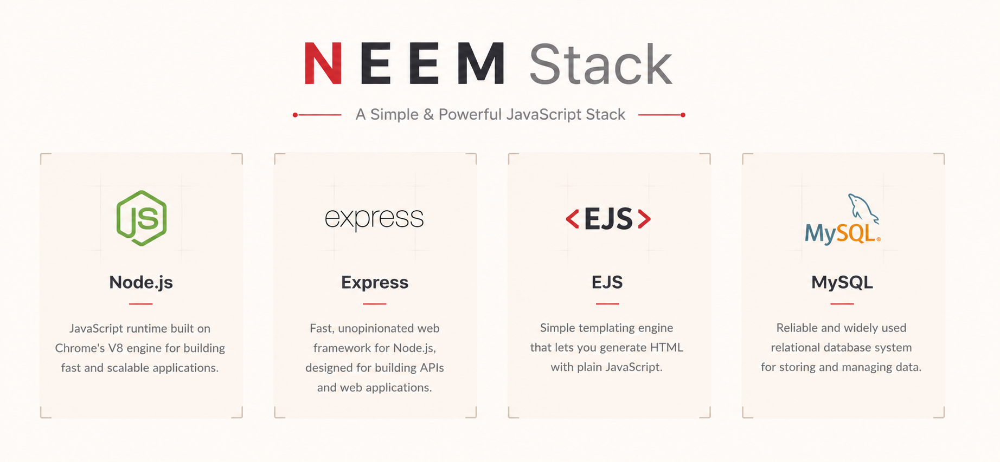

# NEEM Stack Setup



Built and maintained by [Mohamed Aiman](https://darkguyaiman.com).

An interactive terminal setup assistant for a Node.js server stack:

- **N**ginx reverse proxy
- Nod**e**.js + PM2
- MySQL
- Micro terminal editor
- Glances system monitor
- Guided domain and HTTPS setup
- Guided Cloudflare Tunnel setup for temporary previews or production hostnames
- MySQL Workbench on Windows

It supports Linux, macOS, and Windows with native scripts. Node.js is one of the
components NEEM can install, but it is not required to launch the setup tool.

## Project structure

The platform implementations are modular so individual features can be changed
without editing one large script:

```text
windows/
  neem.cmd              Command Prompt launcher and elevation handling
  neem.ps1              PowerShell entry point and module loader
  modules/              Core, packages, web, health, MySQL, components, menu
linux/
  neem.sh               Linux/macOS entry point and module loader
  modules/              Core, packages, web, health, MySQL, menu
```

The root `neem.ps1`, `neem.sh`, `neem.cmd`, and `Start-NEEM.cmd` files remain
small compatibility launchers. Existing commands, shortcuts, and command
installations therefore continue to work. New behavior should be implemented in
the relevant platform module rather than in a root launcher.

## Testing

Run the complete suite on Windows with Git for Windows installed:

```powershell
.\tests\run.ps1
```

Run the Bash behavior suite on Linux or macOS with:

```bash
bash tests/run.sh
```

The tests exercise the PowerShell modules, all CMD compatibility launchers, Bash
module loading, command help and failure paths, validators, cross-platform backup
path handling, module encoding, line endings, and the static project invariants.
They avoid installation, elevation, and system-configuration operations.

## What NEEM can do

| Action | Behavior |
| --- | --- |
| Install components | Shows only components that are not currently detected and supports selecting several at once. |
| Remove components | Shows only detected components and asks for confirmation before removal. |
| Install complete stack | Installs only the missing parts of the recommended stack. |
| Configure PM2 startup | Helps restore managed Node.js applications after a restart. |
| Connect a domain | Creates and validates an Nginx reverse proxy for a selected PM2 application. |
| Enable HTTPS | Uses Certbot on Linux/macOS or win-acme on Windows. |
| Configure Cloudflare Tunnel | Installs `cloudflared`, starts temporary Quick Tunnels, or guides a production tunnel service setup. |
| Inspect stack health | Shows component paths, Nginx status, and a compact PM2 application list. |
| Creator and support | Shows the creator portrait, contact links, and support links in a responsive layout. |

### Components

| Component | Windows | Linux/macOS |
| --- | :---: | :---: |
| Node.js and npm | Yes | Yes |
| PM2 | Yes | Yes |
| MySQL Server | Yes | Yes |
| MySQL Workbench | Yes | — |
| Nginx | Yes | Yes |
| Micro editor | Yes | Yes |
| Glances monitor | Yes | Yes |
| SSL client | win-acme | Certbot |
| Cloudflare Tunnel | Yes | Yes |

## Terminal theme

NEEM uses a true-color terminal palette with `#c51d34` red accents,
`#2e2e30` selected surfaces, `#808080` and `#5a5a5a` secondary text,
`#f5f5f5` light text, and `#fdfbf7` cream-white primary text. Older terminals
receive the nearest available console colors automatically.

## Interactive component picker

The main command palette and component picker are fully keyboard-operated:

- **Up / Down** moves through the component list.
- **Enter** opens the highlighted main-menu action.
- **Space** ticks or unticks the focused component.
- **A** toggles every component.
- **Enter** reviews and confirms a component batch.
- **Escape** cancels without making changes.
- **1–9** remain available as quick main-menu shortcuts.

For example, you can tick MySQL, PM2, and Nginx and install all three in one
run. Removal uses the same picker and always asks for confirmation. Database
removal never deliberately deletes existing database files or configuration;
review your package manager's behavior and keep a backup before uninstalling.

The install picker shows only missing components. The remove picker shows only
components detected on the machine. **Install complete stack** also calculates
the missing set first and leaves existing tools untouched.

The health screen uses a compact NEEM-native status table and a concise PM2
application list instead of PM2's full-width default box table.

## MySQL database backups

Choose **Back up a MySQL database** from the menu, or run `neem --backup` on
Linux/macOS and `.\neem.ps1 -Backup` on Windows. NEEM connects with MySQL's
hidden password prompt, lists only user databases, and lets you select one. You
can include all CREATE statements (recommended for a complete restore) or make
a data-only dump for an existing schema.

The backup and database-user workflows are divided into clearly labelled steps.
Database lists use an arrow-key picker: press **Up / Down** to move, **Enter** to
select, or **Escape** to cancel without making changes. Long lists scroll while
keeping the selected database visible.

The dump uses `utf8mb4`, a consistent transaction, hexadecimal binary values,
complete column lists, and omits source-server metadata that commonly causes
cross-machine restore errors. Routines, events, and triggers are included with
CREATE statements. NEEM writes to a temporary `.partial` file, checks that the
result is non-empty valid UTF-8, and only then publishes the `.sql` file. Before
creating it, NEEM prompts for a destination directory. Press **Enter** to use
`~/neem-backups` on Linux/macOS or `Documents\NEEM Backups` on Windows. The
prompt accepts paths with spaces, `~`, native paths, and Windows or Unix-style
separators. Windows drive paths are translated by the Unix launcher when it is
running in WSL or Git Bash. The result screen prints ready-to-run `scp` commands
for Windows, macOS, and Linux clients.

The consistent snapshot guarantee applies to transactional tables such as
InnoDB. Restore into a compatible MySQL/MariaDB version; vendor-specific SQL
features may still require the same or a newer server version.

## MySQL database users

Choose **Manage MySQL users** to create an account for one database, create an
account for all databases, or view the accounts already present on the server.
The account list shows both `User` and `Host`, because MySQL uses that pair to
identify each account. The one-database workflow lists the available user
databases and grants access to exactly one selection. Both creation workflows
perform `CREATE USER`, `GRANT ALL PRIVILEGES`, and `FLUSH PRIVILEGES` together.

The **all databases** option grants `ALL PRIVILEGES ON *.*`. This is server-wide
access covering system schemas plus every current and future database, so NEEM
shows a dedicated warning and confirmation before collecting account details.
Use it only for accounts that genuinely need that level of control.

Direct commands continue to create a user for one database: run
`neem --create-db-user` on Linux/macOS or
`.\neem.ps1 -CreateDatabaseUser` on Windows.

The other user-management actions also have direct commands:

```text
neem --create-global-db-user
neem --list-db-users

.\neem.ps1 -CreateGlobalDatabaseUser
.\neem.ps1 -ListDatabaseUsers
```

The new password is entered twice through hidden input and is never shown in a
command preview. Usernames use a portable 32-character-safe format. The account
defaults to connections from `localhost`; choosing `%` is supported but clearly
warned because it permits authentication from any network address that can
reach MySQL.

## Quick start

### Windows — double-click or Command Prompt

Double-click `Start-NEEM.cmd`, or run it from Command Prompt:

```bat
Start-NEEM.cmd
```

NEEM automatically asks for administrator access when it is needed.

To make `neem-stack` available in every new terminal, run this once:

```powershell
powershell -ExecutionPolicy Bypass -File .\Install-NEEM-Command.ps1
```

Open a new PowerShell or Command Prompt window, then start NEEM from anywhere
with either command:

```powershell
neem-stack
neem
```

When launched from Command Prompt, NEEM requests administrator access by opening
an elevated Command Prompt—not a PowerShell prompt. PowerShell is used only as
the internal Windows execution engine. The installed commands point to the live
project folder, so interface updates appear immediately; rerun the command
installer only if you move the project.

### Linux

```bash
chmod +x install-neem-command.sh
./install-neem-command.sh
```

Open a new terminal, then start NEEM from anywhere:

```bash
neem-stack
# or: neem
```

The command installer writes only to your user folders and does not need root.
NEEM itself asks for `sudo` only when a system change needs root access.
Supported package managers are `apt`, `dnf`, `yum`, `pacman`, and `zypper`.

### macOS

Install [Homebrew](https://brew.sh), then install the command:

```bash
chmod +x install-neem-command.sh
./install-neem-command.sh
```

Open a new terminal and run:

```bash
neem-stack
# or: neem
```

For a public domain, NEEM switches Nginx from the user-level Homebrew service
to a privileged process so it can bind to ports 80 and 443.

### Windows — run the script directly

Open PowerShell as Administrator:

```powershell
Set-ExecutionPolicy -Scope Process Bypass
.\neem.ps1
```

Windows needs either `winget` or Chocolatey. Nginx on Windows is suitable for
development and light workloads; for a production Internet server, Linux is the
recommended deployment target. MySQL Workbench is available as its own checkbox
and is included in the complete Windows stack.

## Guided deployment

1. Choose **Install complete stack** (or install only what you need).
2. Start your app, for example:

   ```bash
   cd /srv/my-app
   npm ci
   pm2 start npm --name my-app -- start
   ```

3. Choose **Configure PM2 startup**, then follow the command PM2 prints.
4. Point the domain's DNS `A` record to the server's public IPv4 address.
5. Choose **Connect a domain to a PM2 app**.
6. Select the PM2 process, enter its local port, and confirm the domain.
7. NEEM writes and validates the Nginx reverse-proxy configuration.
8. Choose SSL when prompted. Linux/macOS use Certbot; Windows uses win-acme.

NEEM checks the local app, DNS, and Nginx syntax before reloading the server. It
backs up an existing managed site file before replacing it.

## Guided Cloudflare Tunnel

Choose **Configure Cloudflare Tunnel** when the application already responds on
a local port. NEEM installs `cloudflared` when needed and offers two paths:

- **Quick tunnel** creates a temporary random `trycloudflare.com` URL without an
  account. NEEM runs it quietly in the background, prints the public URL, and
  lets you exit while the tunnel stays available.
- **Managed tunnel** walks through creating a tunnel and published application
  route in the Cloudflare dashboard, asks for the local application port, then
  installs the connector as a startup service using the tunnel token.

For a managed tunnel, the dashboard route's service URL should match the address
NEEM displays, such as `http://127.0.0.1:3000`. The domain must already be using
Cloudflare DNS. The connector makes outbound connections, so the application can
remain bound to localhost and inbound ports do not need to be opened for the
tunnel itself.

NEEM asks for the intended public hostname, such as `app.example.com`, before
installing the connector. After installation it returns to that exact hostname
and service URL, reopens the dashboard if requested, and waits until the user has
saved the published application route before finishing.

NEEM accepts either the raw `eyJ...` tunnel token or the complete install command
copied from Cloudflare. The prompt supports terminal paste shortcuts such as
`Ctrl+Shift+V`, displays a capped `************` input mask, extracts the token
through hidden input, and never prints
it in the command preview. NEEM validates the credential before replacing an
existing connector service and keeps invalid input on the paste step. Treat the
token as a secret: anyone who has it can run that tunnel. Add
or change public hostnames later in **Networking > Tunnels** in the Cloudflare
dashboard. Only one `cloudflared` service can be installed per machine, but that
one tunnel can contain several published application routes.

To review or control tunnels, return to **Configure Cloudflare Tunnel** and
choose **View or stop tunnels**. NEEM shows Quick and managed tunnels together
with their service state, local port, public URL, and publication time. Quick
Tunnels can be stopped, while a managed tunnel service can be stopped and
started again. NEEM verifies tracked processes so unrelated `cloudflared`
processes are not stopped accidentally. Tunnel diagnostic logs and state are stored under
`%LOCALAPPDATA%\NEEM\quick-tunnels` on Windows or
`${XDG_STATE_HOME:-~/.local/state}/neem/quick-tunnels` on Linux and macOS.
If NEEM finds a managed service created before tunnel tracking was added, it
offers a one-time metadata import for the hostname, port, and publication time.

## Command-line options

```text
./neem.sh --dry-run       # preview package/privileged commands
./neem.sh --health        # component and Nginx status
./neem.sh --backup        # create a portable MySQL dump
./neem.sh --create-db-user # create a database-scoped MySQL user
./neem.sh --create-global-db-user # create a server-wide MySQL user
./neem.sh --list-db-users  # list MySQL users and allowed hosts
./neem.sh --help

.\neem.ps1 -DryRun
.\neem.ps1 -Health
.\neem.ps1 -Backup
.\neem.ps1 -CreateDatabaseUser
.\neem.ps1 -CreateGlobalDatabaseUser
.\neem.ps1 -ListDatabaseUsers
.\neem.ps1 -Update
.\neem.ps1 -Help

neem --update
neem-stack --update
```

`neem --update` and `neem-stack --update` check the project’s GitHub `main`
branch. A Git checkout updates only through a clean fast-forward and refuses to
overwrite local changes. A ZIP/downloaded copy asks for confirmation before it
downloads and replaces NEEM program files. After updating, NEEM refreshes the
global command wrappers automatically. The installed commands always point to
the live project folder; they do not keep a separate frozen copy of NEEM.

## What the scripts change

- Installs packages through the operating system's package manager.
- Installs PM2 globally with npm.
- Enables database and Nginx services where the operating system supports it.
- Writes one Nginx file per domain, named `neem-<domain>.conf`.
- Creates `/var/www/letsencrypt` on Linux/macOS for ACME challenges.
- Requests certificates only after explicit confirmation.
- Registers certificate renewal using Certbot or win-acme.
- Optionally installs `cloudflared` and registers a managed tunnel as a service.

MySQL installation requires Oracle's MySQL LTS package in the configured
repository. Arch's MariaDB package is not substituted for MySQL. Always run `mysql_secure_installation`
and create a dedicated, least-privilege database user for each application.

## Security notes

- Review DNS and firewall rules before requesting a certificate. Ports 80 and
  443 must reach Nginx.
- Keep the application bound to `127.0.0.1`; expose it through Nginx.
- Do not run Node.js applications as root.
- The scripts never collect database passwords or place secrets in Nginx files.
- Tunnel tokens are accepted through hidden input and redacted from command output.
- Use `--dry-run` / `-DryRun` to review installation commands first.

## Troubleshooting

Run the health check from the menu. Useful commands:

```bash
pm2 ls
pm2 logs <app-name>
curl http://127.0.0.1:<port>
sudo nginx -t
sudo certbot renew --dry-run
sudo systemctl status cloudflared
```

On Windows, reopen PowerShell after installing a component if its executable is
not yet on `PATH`.

## Creator

- **Email:** [mohamedaiman103@gmail.com](mailto:mohamedaiman103@gmail.com)
- **Portfolio:** [darkguyaiman.com](https://darkguyaiman.com)
- **LinkedIn:** [darkguyaiman](https://www.linkedin.com/in/darkguyaiman)
- **Instagram:** [darkguyaiman](https://www.instagram.com/darkguyaiman)
- **X (Twitter):** [thedarkguyaiman](https://x.com/thedarkguyaiman)

The interactive terminal also includes a creator screen with the supplied ASCII
portrait and these contact details. In terminals that support OSC 8 links,
including Windows Terminal, the links are clickable. The portrait and link panel
appear side-by-side in wide terminals and automatically reflow while the creator
screen is open when the terminal is resized. Classic Command Prompt does not
implement OSC 8 mouse hyperlinks, so press **1–7** to open the corresponding
link there.
The portrait is lightly downsampled in the terminal to preserve the side-by-side
layout without changing the original ASCII source file.

## Support the project

<a href="https://ko-fi.com/darkguyaiman" target="_blank">
  
</a>
&nbsp;&nbsp;
<a href="https://paypal.me/thedarkguyaiman" target="_blank">
  
</a>

## Project validation

On Windows:

```powershell
powershell -NoProfile -ExecutionPolicy Bypass -File .\tests\validate.ps1
```

On Linux/macOS, also validate the Bash script with:

```bash
bash -n neem.sh
```

## Releasing a new version

The plain-text [`VERSION`](VERSION) file is the project's one source of truth
for the release number. Use a semantic version such as `1.1.0` or
`1.1.0-beta.1`.
Both `neem.ps1` and `neem.sh` load and validate that value at startup, so the
banner and help output stay synchronized.

After changing `VERSION`, run the project validation command above and confirm
that both launchers report the new number:

```text
NEEM Stack Setup v1.1.0
```

## License

MIT

## Production release selection

New Node.js, MySQL, and Nginx installs use native platform scripts to check vendor
metadata at install time. Node.js selects the newest published LTS version;
MySQL selects the newest LTS version listed on its Community download page;
Nginx selects its current stable release (Nginx Open Source has no LTS channel).
Patch versions are resolved each time rather than frozen in this repository.

Release checks do not require Python. Windows uses its bundled curl.exe (or
PowerShell HTTPS fallback) and built-in PowerShell JSON support.
Linux/macOS automatically install curl and jq through the
system package manager if missing, then continue in the same run. The checker
needs HTTPS access to nodejs.org, dev.mysql.com, and nginx.org. Dry runs do not
download metadata or install these tools. Glances (and Certbot on Linux) may
still bring Python as their own automatically installed dependency.

Windows requests the exact version through winget or Chocolatey. Linux checks
repository versions and retains distribution revision suffixes. Homebrew uses
`node@<major>` and `mysql@<major.minor>` and checks their patch versions. Add
the displayed versioned Node and MySQL bin directories to your shell PATH on macOS.
If vendor metadata cannot be verified or the required package is unavailable,
installation stops instead of choosing an older version, MySQL Innovation,
or MariaDB. Configure the appropriate vendor repository/channel and retry.
NEEM does not automatically add third-party repositories. Arch MySQL setup
requires a separate Oracle MySQL LTS installation.

Other tools retain their existing non-prerelease package-manager, npm, pip,
or official GitHub release sources. They are not certified vulnerability-free.
This is a release-selection policy, not a vulnerability scanner or automatic
update service. Existing components are retained and skipped by the installer;
keep their security patches current separately. Back up and plan database
major-version upgrades. LTS alone does not guarantee fewer vulnerabilities,
and a distribution may backport fixes to an older upstream version that this
strict policy still rejects.
